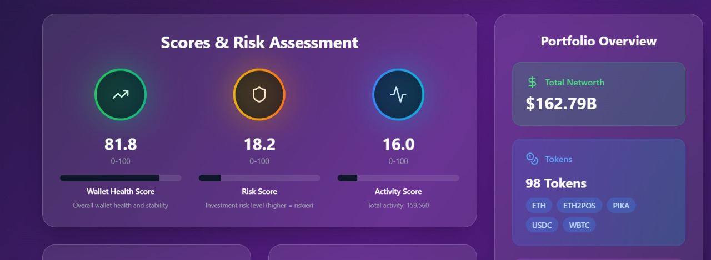

# 🦄 Onchain Persona Genesis


## Live Demo
- **Streamlit App:** [https://kgen-wallet-persona.streamlit.app/](https://kgen-wallet-persona.streamlit.app/)
- **Backend API:** [https://kgen-backend.onrender.com](https://kgen-backend.onrender.com)

## Overview
Onchain Persona Genesis is a full-stack, AI-powered wallet persona web app designed for hackathons and rapid prototyping. It dynamically analyzes any Ethereum wallet address, generates a rich persona profile using both onchain data and advanced AI models, and presents the results in a beautiful, interactive dashboard.

---

## Key Features
- **AI-Powered Persona Generation:**
  - Uses HuggingFace's Mistral-7B-Instruct-v0.2 model to generate detailed, human-like wallet personas.
  - Integrates onchain data (tokens, DeFi, NFTs, activity) for deep analysis.
- **Dynamic Data Pipeline:**
  - Fetches and processes wallet data from local CSVs and Moralis API.
  - Extracts features, risk scores, and behavioral tags.
- **Modern Frontend:**
  - Built with React + TypeScript + Tailwind CSS for a responsive, hackathon-ready UI.
  - Visualizes portfolio, risk, activity, and recommendations with interactive charts.
- **Streamlit Data Science App:**
  - Python-based dashboard for rapid prototyping and AI persona exploration.
- **Backend API:**
  - Node.js/Express server with Python integration for persona generation.
  - Deployed on Render for easy cloud access.

---

## Architecture

```
[User/Frontend] ⇄ [Express Backend API] ⇄ [Python AI/Feature Extraction] ⇄ [Moralis API/CSV Data]
```

- **Frontend:** `src/` (React, TypeScript, Tailwind, modern UI components)
- **Backend:** `backend/` (Node.js, Express, Python integration)
- **Data Science/AI:** `backend/app.py`, `backend/wallet_persona_ai.py`, `backend/dataLoading.py`
- **Data:** `backend/web3_kgenX_new/` (CSV files for tokens, net worth, stats, etc.)

---

## Visual Walkthrough

### 1. Landing Page & Wallet Input


### 2. Persona Profile, Portfolio Visualization & AI Summary 


### 3. Risk & Activity Analysis


### 4. Recommendations & Timeline


---

## How It Works

1. **User enters a wallet address** in the web UI or Streamlit app.
2. **Backend fetches and processes data** from local CSVs and/or Moralis API.
3. **Feature extraction** computes net worth, DeFi/NFT stats, activity, and risk.
4. **AI persona generation** (optional):
   - The backend or Streamlit app loads the Mistral-7B model via HuggingFace.
   - Generates a markdown persona profile based on extracted features.
5. **Frontend displays** persona, scores, portfolio, and recommendations with interactive charts and beautiful UI.

---

## Setup & Usage

### 1. Clone the Repo
```sh
git clone https://github.com/Thunder25Beast/onchain-persona-genesis
cd onchain-persona-genesis
```

### 2. Install Dependencies
- **Backend:**
  ```sh
  cd backend
  pip install -r requirements.txt
  npm install
  ```
- **Frontend:**
  ```sh
  npm install
  ```

### 3. Run Locally
- **Streamlit App (Data Science/AI):**
  ```sh
  cd backend
  streamlit run app.py
  ```
- **Fullstack Web App:**
  - Start backend: `node index.js` (or deploy to Render)
  - Start frontend: `npm run dev`

### 4. Deploy
- **Backend:** Deploy `backend/` to Render (see backend/Procfile and deployment notes)
- **Frontend:** Deploy to Vercel/Netlify or your preferred platform
- **Streamlit:** Deploy `app.py` to [Streamlit Community Cloud](https://streamlit.io/cloud)

---

## AI Persona Generation Details
- Uses HuggingFace's Mistral-7B-Instruct-v0.2 for persona markdown.
- Requires a HuggingFace access token (set in code or via UI).
- Persona includes:
  - Crypto identity, trading style, risk profile, blockchain preferences
  - Personalized recommendations
  - Markdown output for easy display

---

## Data Sources
- **Local CSVs:** `backend/web3_kgenX_new/`
- **Moralis API:** For live wallet data (requires `MORALIS_API_KEY` in `.env`)

---

## File Structure (Key Parts)
```
backend/
  app.py                # Streamlit dashboard
  wallet_persona_ai.py  # AI persona generator (was test.py)
  dataLoading.py        # Feature extraction & data loading
  web3_kgenX_new/       # CSV data
  requirements.txt      # Python dependencies
  index.js              # Node.js backend (Express)

src/
  components/           # React UI components
  images/               # App screenshots & illustrations
```

---

## Credits & Acknowledgements
- Built for hackathons and rapid prototyping by Team DeFiScore.
- Uses open-source models and APIs: HuggingFace, Moralis, Mistral-7B, React, Streamlit, Plotly.

---

## License
MIT
